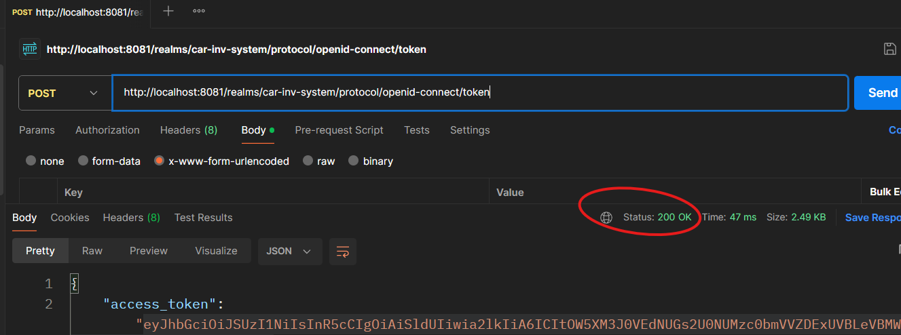
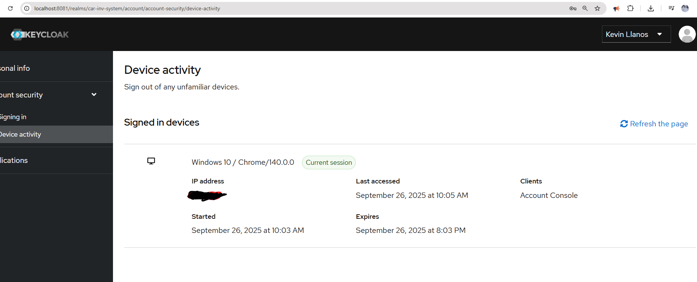
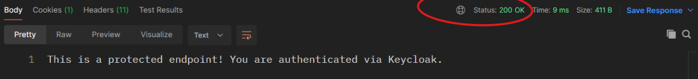
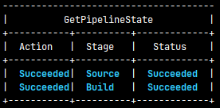
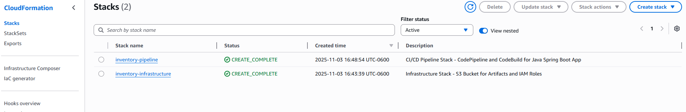
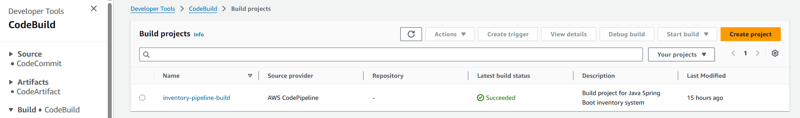
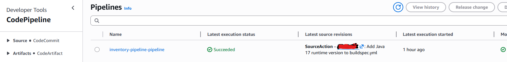
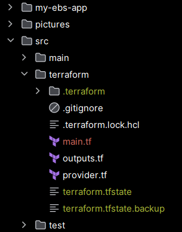
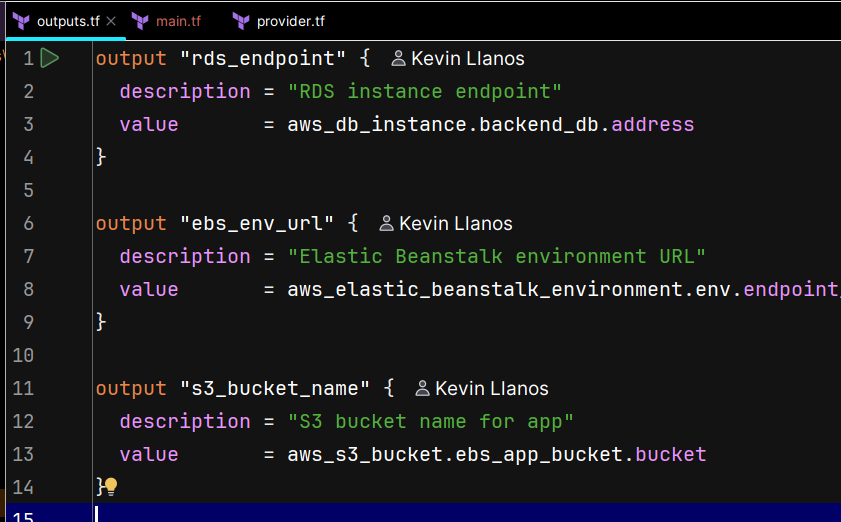
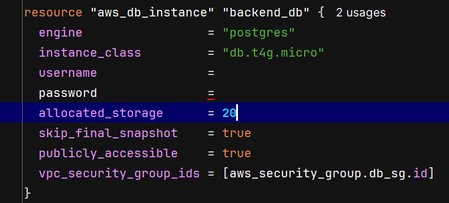

# AWS FullStack Inventory Management System


http://my-ebs-env.eba-pwmcdgmn.us-east-1.elasticbeanstalk.com/mainscreen   *NO LONGER HOSTED!*
## Overview

This project demonstrates inventory management by filtering for engine parts and car products. It includes indexing as well as search functionality for either parts or products. CRUD is used in the project to create, update, and delete engine parts and car products. The theme of the project focuses on car products which will be car models in this case, with engine parts corresponding to each product.

**LIVE DEMO:** https://carsupplyshop.netlify.app/ 


## Features

* **Comprehensive Inventory Management**. Manage and maintain a detailed inventory of car parts and products.
* **Advanced Search and Filtering**. Quickly locate specific car parts or products using the powerful search and filter functionalities.
* **CRUD Operations**. Users can seamlessly add new parts or products, update existing records, and delete items that are no longer needed.
* **User-Friendly Interface**. Includes buttons for adding in-house or outsourced parts, as well as update and delete actions for each item, ensuring smooth navigation.
* **Downloadable CSV Report**. Export current inventory into a CSV file for audits or records.
* **UI Part/Model Association**. Assign multiple parts to products with a clean visual interface.


## Technologies Used

* **Backend**: Spring Boot
* **Frontend**: React – [Frontend Repo](https://github.com/KevinLlano/React-Frameworks2.0.git)
* **Database**: H2 (Development), PostgreSQL (Production)
* **Hosting**: AWS EC2, AWS Elastic Beanstalk
* **Version Control**: Git & GitHub
* **Infrastructure as Code**: AWS CloudFormation (YAML), Terraform (Legacy)
* **CI/CD Pipeline**: AWS CodePipeline, AWS CodeBuild, Amazon S3

**Libraries & Tools**:
- AWS CloudFormation (Infrastructure as Code)
- AWS CodePipeline (CI/CD Orchestration)
- AWS CodeBuild (Automated Builds)
- Amazon S3 (Artifact Storage & Caching)
- Terraform (Legacy EBS Deployment)
- Spring Boot Starter Web
- Spring Boot Starter Data JPA
- Spring Boot Starter Security
- Spring Boot Starter OAuth2 Resource Server
- Keycloak (Authentication & Authorization)
- Thymeleaf
- Spring Boot Starter Validation
- Spring Boot DevTools
- H2 Database (Legacy)
- PostgreSQL
- Spring Boot Starter Test
- JUnit
- Mockito
- Lombok
- Maven


## UML Overview

The system models a **many-to-many** relationship between Products and Parts using a `product_part` join table.

* **Products** = car models with ID, name, price, inventory
* **Parts** = either **InhousePart** (includes part ID) or **OutsourcedPart** (includes company name)
* Uses **single-table inheritance** for part types


---


# Getting Started

## Prerequisites

* **JDK 17+**
* **Maven**
* **Node.js & npm**

---

## 🛠️ Installation

### Step 1: Clone the Repository

```bash
git clone https://github.com/KevinLlano/Java-Frameworks2.0.git
```

### Step 2: Backend Setup

```bash
cd backend
./mvnw spring-boot:run
```

URL: `http://localhost:8080`

### Step 3: Frontend Setup

```bash
cd frontend
npm install
npm start
```

URL: `http://localhost:3000`

---

## Usage

* Use buttons to **add/update/delete** inhouse and outsourced parts
* **Associate parts with products**
* **Search** parts/products by name/type
* **Export inventory** via "Download CSV Report" button

---

## Step 4: AWS Deployment

```bash
./mvnw clean package
eb init -p java-17 car-inventory-app
eb create car-parts-inventory-env
eb deploy
```

RDS setup:

* Create PostgreSQL RDS on AWS Console
* Update `application.properties`:

```properties
spring.datasource.url=jdbc:postgresql://<rds-endpoint>:5432/car_parts_inventory
spring.datasource.username=your_user
spring.datasource.password=your_password
```

---

# Unit Testing

## Tools

* JUnit 5
* Mockito
* Spring MVC (Model)

## Key Tests

* **MainScreenControllerTest**

  * Validates `listPartsandProducts()` method using mock services
* **DeletePartValidatorTest**

  * Checks if part is safe to delete (no linked product)

## Test Sample

```java
when(mockPartService.listAll("")).thenReturn(Collections.emptyList());
verify(mockModel).addAttribute("parts", Collections.emptyList());
assertEquals("mainscreen", result);
```


## ✅ Pass Criteria

* Model receives correct attributes
* View returned is `"mainscreen"`

---

# Authentication & Authorization

This project uses Keycloak for authentication and authorization to secure backend endpoints.

**Setup Overview:**
- Keycloak was deployed via Docker and configured with a dedicated realm and client for the backend.
- Spring Boot was integrated with Keycloak using the `keycloak-spring-boot-starter` and `spring-boot-starter-oauth2-resource-server` dependencies.
- Backend endpoints are protected using JWT tokens issued by Keycloak. Only authenticated users can access protected resources.
- Users and clients are managed in Keycloak; tokens are obtained via the OpenID Connect password grant and used as Bearer tokens in API requests.
- Example endpoint `/api/secure` demonstrates how authentication is enforced and can be tested using Postman with a valid access token.

**Key Steps:**
1. Start Keycloak and create a realm and client for the backend.
2. Configure Spring Boot with Keycloak settings in `application.properties`.
3. Protect endpoints using Spring Security and JWT validation.
4. Obtain a token from Keycloak and use it to access secured endpoints.





---


# Developer Installation Guide

### System Requirements

* Java 17
* Maven 3.8+
* PostgreSQL 13+
* AWS CLI
* Git

### Setup

```bash
git clone [https://gitlab.com/wgu-gitlab-environment/student-repos/kllano2/d424-software-engineering-capstone.git](https://github.com/KevinLlano/AWS-Inventory-Management-System)
cd aws-inventory-system
```

* Create DB:

```sql
CREATE DATABASE car_parts_inventory;
```

* Update `application.properties`:

```properties
spring.datasource.url=jdbc:postgresql://localhost:5432/car_parts_inventory
spring.datasource.username=your_user
spring.datasource.password=your_password
```

### Run Locally

```bash
mvn clean install
mvn spring-boot:run
```

---

# User Guide

## Accessing the App

URL: [https://car-parts-inventory-app.elasticbeanstalk.com](https://car-parts-inventory-app.elasticbeanstalk.com)

## Homepage

* View all parts and products
* Search by name/type
* Download CSV report

## Adding a Part

1. Click **"Add Part"**
2. Choose **Inhouse** or **Outsourced**
3. Fill form
4. Submit


## Adding a Product

1. Click **"Add Product"**
2. Fill in details
3. Associate parts
4. Submit


## Deleting

* Click **"Delete"**
* Only works if part is not linked to a product
* Warning confirmation shown


## Search

* Case-insensitive partial search
* Supports both parts and products


## CSV Report

* Click “Download CSV Report”
* Includes: Name, Inventory, Price, Product Count, Timestamp


## AWS CI/CD Pipeline: CloudFormation + CodeBuild + Codepipeline


**This project demonstrates enterprise-grade DevOps practices by implementing a fully automated **CI/CD pipeline** using AWS CloudFormation, CodePipeline, and CodeBuild.**




#### Architecture Overview

```
GitHub Repository (main branch)
         ↓
CodePipeline (Automated Trigger)
         ↓
CodeBuild (Java 17 Maven Build)
         ↓
S3 Artifact Repository
         ↓
Deployment Ready (JAR + Dependencies)
```

#### Key Components

**1. CI/CD Orchestration (AWS CodePipeline)**
- **Fully Managed Pipeline Service**: Automates the entire CI/CD workflow from source to artifact
- **Multi-Stage Orchestration**: Coordinates execution of Source → Build stages with automatic triggering
- **GitHub Integration**: Uses CodeStar Connections for secure GitHub webhook-based triggers (no personal access tokens)
- **Workflow**: 
  - Detects code changes on main branch
  - Automatically pulls latest code from GitHub
  - Triggers CodeBuild for compilation and packaging
  - Stores build artifacts in S3
- **Status Monitoring**: Provides real-time pipeline execution status and build logs

**2. Infrastructure as Code (CloudFormation)**
- Two separate CloudFormation templates for clean separation of concerns:
  - `cloudformation-infrastructure.yml` – Provisions core AWS resources (S3, IAM roles, CodeBuild project)
  - `cloudformation-pipeline.yml` – Configures the CI/CD pipeline (CodePipeline stages and GitHub integration)
- **Benefit**: Infrastructure is version-controlled, reproducible, and auditable
- **Cost Optimization**: Uses cheapest compute tier (BUILD_GENERAL1_SMALL)

**3. Continuous Integration (CodeBuild)**
- **Automated Builds**: Every push to the main branch triggers an automatic build
- **Build Specification** (`buildspec.yml`):
  - Compiles Java 17 Spring Boot application using Maven
  - Runs minimal automated tests 
  - Packages application as a production-ready JAR file
  - Implements S3 caching for Maven dependencies to reduce build times
- **Build Artifacts**: JAR files stored in S3 for secure storage and easy retrieval

**4. Artifact Management (Amazon S3)**
- **Artifact Storage**: CloudPipeline automatically stores build outputs in S3
- **Caching**: Maven dependency cache stored in S3 to speed up subsequent builds
- **Versioning**: Build artifacts are timestamped and easily retrievable
- **Cost-Effective**: S3 lifecycle policies manage old artifacts automatically

**5. GitHub Integration (CodeStar Connections)**
- Secure OAuth2-based authentication to GitHub
- No hardcoded credentials or personal access tokens in code
- Automatic source code polling and change detection

#### Performance & Cost Metrics

| Metric | Value |
|--------|-------|
| Build Time | ~2 minutes per execution |
| Build Compute | BUILD_GENERAL1_SMALL (cheapest option) |
| Monthly CodePipeline Cost | ~$2-3 (first execution free, $1 per execution after) |
| Monthly CodeBuild Cost | ~$0.15 (5 min builds × 30 executions = ~150 min) |
| Artifact Storage | S3 with lifecycle policies |
| **Total Monthly Cost** | **~$2-5** |

#### Deployment Process

```bash
# Deploy infrastructure stack
aws cloudformation create-stack \
  --stack-name inventory-infrastructure \
  --template-body file://cloudformation-infrastructure.yml \
  --capabilities CAPABILITY_IAM

# Deploy pipeline stack
aws cloudformation create-stack \
  --stack-name inventory-pipeline \
  --template-body file://cloudformation-pipeline.yml \
  --parameters ParameterKey=GitHubConnectionArn,ParameterValue=<your-connection-arn>
```

#### What This Demonstrates

✅ **DevOps Best Practices**
- Infrastructure as Code (IaC) using CloudFormation
- Automated build and deployment pipeline
- Environment consistency and reproducibility

✅ **CI/CD Maturity**
- Hands-off deployment (no manual build steps)
- Artifact versioning and storage
- Build caching for performance optimization

✅ **Cloud Architecture Knowledge**
- Multi-stage pipeline orchestration
- IAM role-based security and least privilege access
- Cost-conscious resource allocation

✅ **Integration & Automation**
- GitHub webhook-based CI/CD triggering
- Secure credential management (OAuth2, not API tokens)
- Automated artifact management

#### Technology Stack

- **Infrastructure**: AWS CloudFormation (YAML)
- **CI/CD Orchestration**: AWS CodePipeline
- **Build System**: AWS CodeBuild + Maven
- **Source Control**: GitHub with CodeStar Connections
- **Artifact Storage**: Amazon S3
- **Logging**: Amazon CloudWatch

#### Security Features

- IAM roles with least privilege permissions
- No secrets in version control
- OAuth2-based GitHub authentication
- S3 encryption for artifacts
- CloudWatch logging for audit trails

---

---

---
# Screenshots
# Old + New Screenshots including AWS deployment with RDS, S3, EC2, and EBS. provisioned by Terraform






